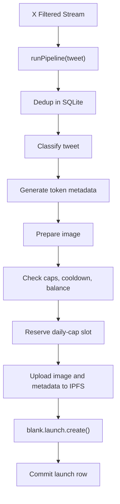

# blank-bot

`blank-bot` is a TypeScript reference bot for the
[`@blankdotbuild/sdk`](https://www.npmjs.com/package/@blankdotbuild/sdk).
It follows X accounts, scores new tweets, builds token metadata and an image,
uploads both to IPFS through Pinata, then calls `blank.launch.create()`.

This is example code. Live mode spends real SOL from a hot wallet. Use a new
wallet, fund it lightly, and run in dry mode first.

## What you learn

- How to build a Blank SDK client and wallet adapter.
- How to call `blank.launch.create()` with an idempotency key.
- How to prepare a short `ipfs://...` metadata URI for Blank.
- How to keep SDK errors log-safe when signed transactions are involved.
- How to put safety caps around an automated launch loop.

## How the bot works



Every terminal result is recorded in SQLite as a decision: `launched`,
`dry_run`, `skipped_low_score`, `skipped_validation`, `skipped_safety`, or
`skipped_error`. That makes restarts boring. A tweet that was already handled
does not get handled again unless you run a replay with `--force`.

## Quickstart

```bash
git clone <your-fork-url>
cd blank-bot-launcher
npm install
cp .env.example .env
cp accounts.example.yaml accounts.yaml
npm run check-config
npm run dev -- --dry-run
npm run backtest
```

Fill in `.env` before running `check-config`. Dry mode runs the full pipeline
and skips only the SDK launch call. `check-config` exits non-zero if the
wallet balance is below `MAX_SOL_PER_LAUNCH`.

When you are ready to try live mode, remove `--dry-run`.

## Configuration

The bot reads environment variables from `.env` and followed accounts from
`accounts.yaml`.

Required services:

- Blank API key
- Solana RPC endpoint
- X API bearer token with Filtered Stream access
- Google AI Studio API key for Gemini
- Pinata JWT

Use `.env.example` and `accounts.example.yaml` as templates. Do not commit
`.env`, `accounts.yaml`, `data/`, or generated reports.

## Commands

```bash
npm run dev -- --dry-run              # local run without launching
npm run start                         # live run
npm run backtest                      # dry-run recent tweets from followed accounts
npm run backtest -- --backtest-limit 25
npm run check-config                  # validate env, accounts, caps, and wallet balance
npm run build                         # TypeScript check for src
npm run check                         # TypeScript + Biome for src, tests, and scripts
npm test                              # unit tests
npm run reset-today                   # show daily-counter drift after a hard crash
npm run reset-today -- --apply        # repair today's daily counter
```

The project runs TypeScript through `tsx`, so local use does not require a
separate compile step.

## Backtesting

`npm run backtest` resolves the handles in `accounts.yaml`, fetches the last
50 eligible tweets per account, merges them oldest-first, and runs the
pipeline in dry mode.

Backtests write a fresh SQLite DB and JSON report under `./data/backtests/` by
default. They do not mark tweets as seen in the live bot DB.

```bash
npm run backtest -- --backtest-limit 100
npm run backtest -- --backtest-db ./data/my-backtest.db
npm run backtest -- --backtest-report ./data/backtests/latest.json
```

The report includes the tweet, classifier result, token metadata, prepared
image summary, and final decision for each processed tweet.

## Safety notes

This bot signs transactions with a hot wallet. Treat that wallet as
disposable.

- Generate a new keypair for the bot.
- Fund it with only what you are willing to spend.
- Keep `MAX_SOL_PER_LAUNCH`, `MAX_LAUNCHES_PER_DAY`, and `MAX_SOL_PER_DAY`
  tight.
- Set `WARN_IF_BALANCE_ABOVE_SOL` below any balance you would be upset to
  lose.
- Run `--dry-run` first and inspect the SQLite records before going live.
- The local dashboard binds to `127.0.0.1` only.

## Crash recovery

The pipeline reserves a daily-cap slot before the SDK launch and commits the
launch row only after the SDK confirms. If the process is killed between those
two steps, the daily counter can sit ahead of the launches table. The bot will
then under-launch for the rest of that UTC day.

After a hard crash, run:

```bash
npm run reset-today
npm run reset-today -- --apply
```

The script only touches today's UTC counter.

## Project layout

```text
src/
  brain/       tweet classifier, metadata generator, image preparation
  safety/      caps, cooldown, balance, and RPC reachability checks
  launcher/    Blank SDK and Pinata integration
  sources/     X stream, historical timeline, and mock sources
  store/       SQLite persistence
  dashboard/   optional loopback status page
  pipeline.ts  one tweet through every launch stage
  cli.ts       flag parsing and keypair loading
  index.ts     bootstrap, shutdown, source selection, dashboard wiring
```

The core SDK call is in `src/launcher/blank-launcher.ts`. The full launch flow
is in `src/pipeline.ts`.

## Change the LLM provider

The classifier and metadata generator both accept a Vercel AI SDK
[`LanguageModel`](https://ai-sdk.dev/docs/foundations/providers-and-models).
Swap providers in `src/index.ts`:

```ts
import { anthropic } from '@ai-sdk/anthropic';

const llmModel = anthropic('claude-sonnet-4-6');
```

Image generation in `src/brain/image.ts` calls Gemini's REST API directly
because the AI SDK does not expose image output in the same path used here.
Keep image generation on Gemini, or replace `callGeminiImage()` with your own
provider call.

## Change the tweet source

`src/sources/tweet-source.ts` defines the source interface:

```ts
export interface TweetSource {
  start(handler: TweetHandler): Promise<void>;
  stop(): Promise<void>;
}
```

Add a source that maps your input to the `Tweet` shape, then instantiate it in
`src/index.ts`. The pipeline does not care whether the tweet came from X,
Discord, a queue, or a test fixture.

## Change the image policy

The metadata generator returns `reuse`, `remix`, or `generate`. For a simple
policy change, edit the rules in `src/brain/prompts.ts`. For a hard override,
set `metadata.imageStrategy` inside `src/pipeline.ts` after metadata
generation.

## Image rights

The bot can reuse images attached to tweets. The code cannot decide whether
you have the right to use an image. Follow accounts and media you are allowed
to use.

## Contributing

Issues and PRs are welcome. Keep changes focused. This repo is meant to stay
small enough that someone can read it and understand how the Blank SDK launch
path works.
